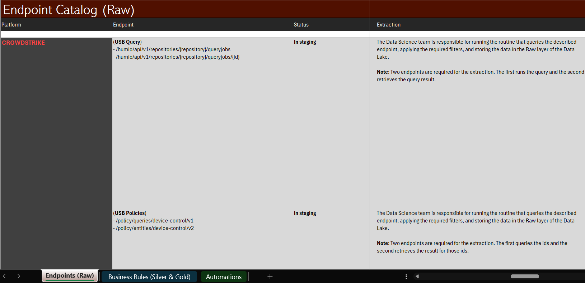
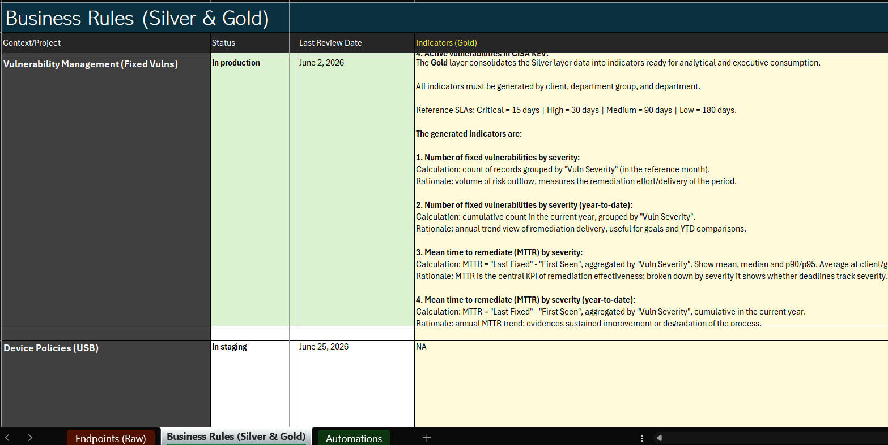
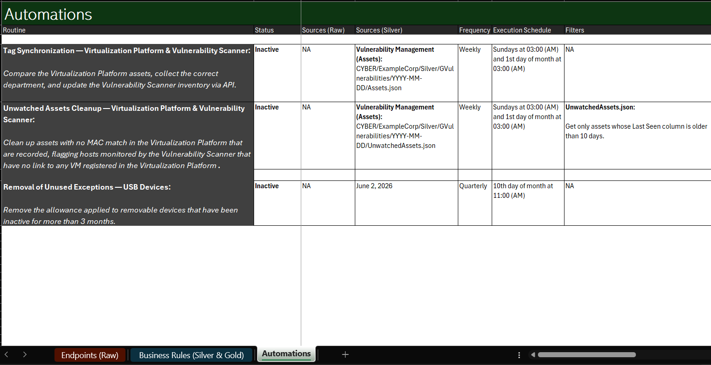

# Data Lake Documentation Template (Legacy)

> A Data Lake concept in a single spreadsheet, mapping every source, rule, and automation in one consistent, auditable place.

---

> ℹ️ A newer version of this project is available [here](https://github.com/jkienen/Catalog-DataLake_v1).

---

## Why This Matters

Automations save time, but every one of them is a decision made on someone's behalf, silently, on a schedule, using logic only the person who wrote it can see. As they multiply across teams and platforms, that convenience turns into risk:

- **No one owns the full picture.** Automations get built script by script, each with its own credentials, schedule, and hard-coded rule. Ask "what automatically deletes, tags, or closes something in production right now?" and the honest answer is usually "let me check with a few people."
- **Evidence disappears with the action.** An automation that deletes or closes a record also removes the only proof it existed. When an audit, an incident, or a customer complaint asks "why is this record gone," there is nothing to point to.
- **Duplicated effort.** Without a shared catalog, two teams solve the same problem twice, slightly differently, against the same source system, doubling the maintenance burden and the number of places a bug can hide.
- **Institutional risk.** The rule that decides what gets changed or deleted lives in one person's script, in one person's head. When that person is unavailable, nobody can safely extend, or even fully trust, what the automation does.

A Data Lake documented this way turns each of those into a reviewable fact instead of tribal knowledge: every automation listed once with its trigger, filters, source data and owner; an **Audit** layer that keeps the record of what was acted on even after the action removes it from the source; sources and rules referenced instead of re-copied, so the second team reuses instead of rebuilding.

That is the case worth making to a manager: not "we documented our data," but **"we can show, at any moment, everything that acts on our systems automatically, why it does it, and what it did, before an incident forces us to find out the hard way."**

---

## Overview

As a Data Lake grows, the hardest thing to keep is not the data; it is the *knowledge* about the data: where each source comes from, how it is transformed, what each indicator means, and which automations act on it. That knowledge usually lives scattered across people, scripts, and chat history.

This template centralizes that knowledge in a single workbook, organized around the **medallion architecture** (Raw → Silver → Gold) plus an **Automations** layer. Each row documents one source, rule, or automation using the same fields, so anyone can read, or extend, the documentation without guessing.

> 📝 **The content currently in the workbook is illustrative only.** It exists to show *how* to fill each field. Replace every example row with your own sources, rules, and indicators.

---

## How It Works

The documentation mirrors the lifecycle of the data across four layers:

<table width="100%">
<thead>
<tr><th>Layer

</th><th>What it holds

</th><th>Documented in

</th></tr>
</thead>
<tbody>
<tr><td><strong>Raw</strong></td><td>Data ingested exactly as the source delivers it, with no transformation.</td><td><code>Endpoints (Raw)</code></td></tr>
<tr><td><strong>Silver</strong></td><td>Cleaned, cross-referenced, and structured data, ready for analysis.</td><td><code>Business Rules (Silver &amp; Gold)</code></td></tr>
<tr><td><strong>Gold</strong></td><td>Business indicators / KPIs derived from the Silver layer.</td><td><code>Business Rules (Silver &amp; Gold)</code></td></tr>
<tr><td><strong>Automations</strong></td><td>Automated actions driven by the curated data.</td><td><code>Automations</code></td></tr>
</tbody>
</table>

Each layer feeds the next: Raw is the input to the Silver rules, the Silver output is consolidated into Gold indicators, and Automations consume the curated datasets to act.

<strong>Detailed architecture</strong> (click to expand)

The diagram above shows the concept; this is the same flow at dataset level, with sources, endpoints, Silver/Gold groupings and automations all named individually.

---

## Workbook Structure

The template has three sheets. Fill **one row per item**.

### 1. `Endpoints (Raw)`: the source catalog

Documents every source endpoint feeding the Raw layer.

<strong>Sheet preview</strong> (click to expand)

<table width="100%">
<thead>
<tr><th>Field

</th><th>Purpose

</th></tr>
</thead>
<tbody>
<tr><td><code>Platform</code></td><td>The source system the data comes from</td></tr>
<tr><td><code>Endpoint</code></td><td>The specific API/endpoint(s) used for extraction</td></tr>
<tr><td><code>Status</code></td><td>Lifecycle of the integration (dropdown)</td></tr>
<tr><td><code>Description</code></td><td>What the endpoint returns, in plain language</td></tr>
<tr><td><code>Load Type</code></td><td><code>Full</code> (full snapshot) or <code>Incremental</code> (only new data)</td></tr>
<tr><td><code>Frequency</code></td><td>How often the extraction runs</td></tr>
<tr><td><code>Volume per Frequency</code></td><td>Approximate data volume per run</td></tr>
<tr><td><code>Execution Schedule</code></td><td>When the routine runs</td></tr>
<tr><td><code>Routine Name</code></td><td>Identifier of the ingestion routine</td></tr>
<tr><td><code>Extraction</code></td><td>How the data is extracted and who is responsible</td></tr>
<tr><td><code>Filters</code></td><td>Conditions / query parameters applied at the source</td></tr>
<tr><td><code>Storage (Raw)</code></td><td>Where and how the raw output is stored (path convention)</td></tr>
<tr><td><code>Sample (Raw)</code></td><td>A representative sample of the stored record</td></tr>
<tr><td><code>Last Review Date</code></td><td>When the entry was last reviewed</td></tr>
<tr><td><code>Owner</code></td><td>Person accountable for the integration</td></tr>
<tr><td><code>Base Project (Github)</code></td><td>Repository hosting the routine code</td></tr>
</tbody>
</table>

### 2. `Business Rules (Silver & Gold)`: transformations and indicators

Documents how Raw data becomes structured Silver datasets, and the Gold indicators derived from them.

<strong>Sheet preview</strong> (click to expand)

<table width="100%">
<thead>
<tr><th>Field

</th><th>Purpose

</th></tr>
</thead>
<tbody>
<tr><td><code>Context/Project</code></td><td>The business context / dataset being produced</td></tr>
<tr><td><code>Status</code></td><td>Lifecycle of the rule (dropdown)</td></tr>
<tr><td><code>Sources (Raw)</code></td><td>Raw inputs the rule reads from (with paths)</td></tr>
<tr><td><code>Sources (Silver)</code></td><td>Silver inputs cross-referenced by the rule (with paths)</td></tr>
<tr><td><code>Execution Schedule</code></td><td>When the processing runs</td></tr>
<tr><td><code>Routine Name</code></td><td>Identifier of the processing routine</td></tr>
<tr><td><code>Filters</code></td><td>Conditions applied during processing</td></tr>
<tr><td><code>Processing Pipeline</code></td><td>Step-by-step description of the transformation logic</td></tr>
<tr><td><code>Data Structuring (Silver)</code></td><td>The columns/structure of the resulting Silver dataset</td></tr>
<tr><td><code>Generated Audits</code></td><td>Secondary datasets produced for tracking/exceptions</td></tr>
<tr><td><code>Storage (Silver)</code></td><td>Where and how the Silver output is stored (path convention)</td></tr>
<tr><td><code>Output (Silver)</code></td><td>A representative sample of the structured record</td></tr>
<tr><td><code>Owner</code></td><td>Person accountable for the rule</td></tr>
<tr><td><code>Base Project (Github)</code></td><td>Repository hosting the routine code</td></tr>
<tr><td><code>Last Review Date</code></td><td>When the entry was last reviewed</td></tr>
<tr><td><code>Indicators (Gold)</code></td><td>The indicators/KPIs derived, with calculation, filters, and rationale</td></tr>
</tbody>
</table>

### 3. `Automations`: automated actions

Documents automations that consume the curated data to act on the environment.

<strong>Sheet preview</strong> (click to expand)

<table width="100%">
<thead>
<tr><th>Field

</th><th>Purpose

</th></tr>
</thead>
<tbody>
<tr><td><code>Routine</code></td><td>What the automation does, in plain language</td></tr>
<tr><td><code>Status</code></td><td>Whether the automation is enabled (dropdown)</td></tr>
<tr><td><code>Sources (Raw)</code> / <code>Sources (Silver)</code></td><td>Datasets the automation reads from (with paths)</td></tr>
<tr><td><code>Frequency</code></td><td>How often it runs</td></tr>
<tr><td><code>Execution Schedule</code></td><td>When it runs</td></tr>
<tr><td><code>Filters</code></td><td>Conditions that select what to act on</td></tr>
<tr><td><code>Processing Pipeline</code></td><td>Step-by-step description of the action logic</td></tr>
<tr><td><code>SOAR Routine Name</code></td><td>Identifier of the automation in the orchestration tool</td></tr>
<tr><td><code>Last Review Date</code></td><td>When the entry was last reviewed</td></tr>
<tr><td><code>Base Project (Github)</code></td><td>Repository hosting the automation code</td></tr>
</tbody>
</table>

---

## How to Use

1. Pick the sheet for what you are documenting (a source, a rule, or an automation).
2. Add **one row** and fill every applicable field, using the dropdowns for `Status`.
3. Follow the **path and naming conventions** above so the entry stays consistent with the rest.
4. Record an `Owner` and a `Last Review Date` so the entry has clear accountability.
5. Keep a representative **sample** in the `Sample` / `Output` field; it is the fastest way for a reader to understand the data shape.

> ✅ Treat the workbook as living documentation: review entries periodically and keep `Status` and `Last Review Date` up to date.

---

## License

Provided as-is for reference and reuse. Adapt it freely to your environment.
